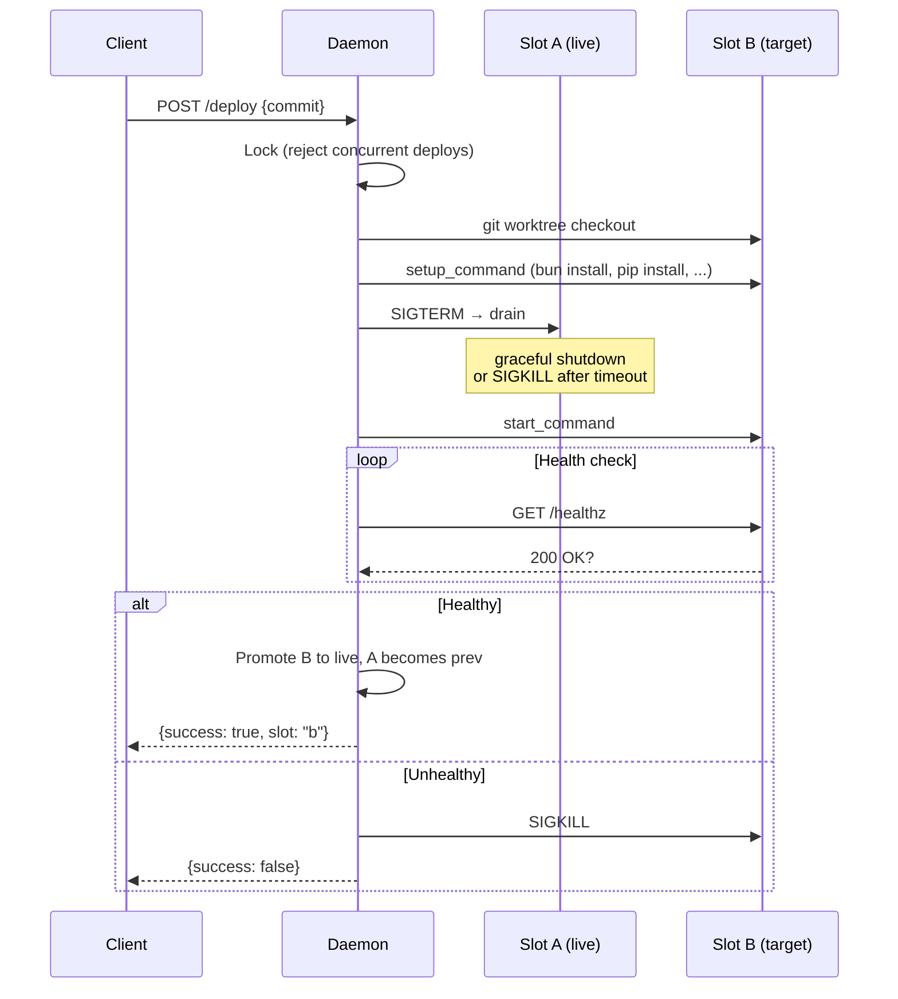

# slot-machine

Blue-green deploys on a single machine. One binary, two slots, zero downtime.

```
slot-machine init       # detect project, generate config
slot-machine start      # start daemon, manage deploys
slot-machine deploy     # deploy HEAD (or a specific commit)
slot-machine rollback   # swap back to previous slot
slot-machine status     # what's running
```

## How it works

The daemon manages two **slots** — independent git worktrees of your app.
At any time, one slot is live and one is the previous deploy (or empty).
Deploys alternate between them:

```
                 ┌─────────────────────────────────────────────┐
                 │              slot-machine daemon             │
                 │                                             │
                 │   ┌─────────┐           ┌─────────┐        │
 POST /deploy ──▶│   │ slot  A │◄── live   │ slot  B │ prev   │
                 │   │ (v3)    │           │ (v2)    │        │
                 │   └────┬────┘           └─────────┘        │
                 │        │                                    │
                 └────────┼────────────────────────────────────┘
                          │
                          ▼
                    :3000  app
```

After the next deploy, the slots swap:

```
                 ┌─────────────────────────────────────────────┐
                 │              slot-machine daemon             │
                 │                                             │
                 │   ┌─────────┐           ┌─────────┐        │
                 │   │ slot  A │ prev      │ slot  B │◄── live│
                 │   │ (v3)    │           │ (v4)    │        │
                 │   └─────────┘           └────┬────┘        │
                 │                              │              │
                 └──────────────────────────────┼──────────────┘
                                                │
                                                ▼
                                          :3000  app
```

Rollback re-starts the previous slot. No re-checkout, no re-install — the
worktree and `node_modules` are already there.

## Deploy sequence



## Quick start

```sh
cd your-app
slot-machine init          # generates slot-machine.json
slot-machine start         # starts daemon on :9100, manages :3000

# in another terminal
slot-machine deploy        # deploy current HEAD
slot-machine deploy abc123 # deploy a specific commit
slot-machine rollback      # swap back
slot-machine status        # check what's live
```

## Configuration

`slot-machine init` detects your project type and generates `slot-machine.json`:

```json
{
  "start_command": "bun server/index.ts",
  "setup_command": "bun install --frozen-lockfile",
  "port": 3000,
  "internal_port": 3000,
  "health_endpoint": "/healthz",
  "health_timeout_ms": 10000,
  "drain_timeout_ms": 5000,
  "env_file": ".env",
  "api_port": 9100
}
```

| Field | What it does |
|-------|-------------|
| `start_command` | How to start your app |
| `setup_command` | Runs after checkout, before start (e.g. install deps) |
| `port` | The port your app listens on (injected as `PORT` env var) |
| `internal_port` | Health check port (injected as `INTERNAL_PORT`) |
| `health_endpoint` | Path to poll for 200 OK |
| `health_timeout_ms` | How long to wait for healthy before giving up |
| `drain_timeout_ms` | Graceful shutdown window before SIGKILL |
| `env_file` | Loaded into the app's environment (secrets, DB paths) |
| `api_port` | Daemon API port for deploy/rollback/status |

Project detection: `bun.lock` → Bun, `package-lock.json` → npm,
`requirements.txt` → pip, `Gemfile.lock` → Bundler.

## The spec

The `spec/` directory defines the contract any slot-machine implementation must
satisfy. It's a Go test suite that treats the binary as a black box — all
interaction is through the CLI and HTTP API.

**17 scenarios:**

| # | Test | What it validates |
|---|------|-------------------|
| 1 | `TestDeployHealthy` | Deploy succeeds, app responds, status correct |
| 2 | `TestDeployUnhealthy` | Failed health check → process killed, no live slot |
| 3 | `TestDeployThenRollback` | A → B → rollback → A is live again |
| 4 | `TestOnlyOnePreviousSlot` | Only the immediately prior deploy is kept |
| 5 | `TestRollbackNoPrevious` | Rollback with nothing deployed → error |
| 6 | `TestConcurrentDeployRejected` | Second deploy during first → 409 |
| 7 | `TestProcessCrashDetected` | Crash sets healthy=false |
| 8 | `TestDrainTimeoutForceKill` | SIGTERM timeout → escalate to SIGKILL |
| 9 | `TestNoArgs` | No args → usage message, exit 1 |
| 10 | `TestUnknownCommand` | Bad subcommand → error |
| 11 | `TestStartMissingConfig` | No config → helpful error |
| 12 | `TestInitBunProject` | Detects bun project, correct config |
| 13 | `TestInitAppendsGitignore` | `.slot-machine` added to `.gitignore`, idempotent |
| 14 | `TestDeployNoRunningDaemon` | Deploy without daemon → connection error |
| 15 | `TestEnvFilePassedToApp` | Env file vars available in the app |
| 16 | `TestSetupCommandRuns` | Setup command executes before start |
| 17 | `TestDaemonShutdownDrainsProcesses` | SIGTERM to daemon → child processes cleaned up |

### Running the spec

```sh
# build
go build -o slot-machine ./cmd/slot-machine/
go build -o spec/testapp/testapp ./spec/testapp/

# test
ORCHESTRATOR_BIN=$(pwd)/slot-machine go test -v -count=1 ./spec/
```

### Writing a new implementation

Write a binary in any language that:

1. Accepts the same subcommands (`init`, `start`, `deploy`, `rollback`, `status`, `version`)
2. `start` accepts `--config`, `--repo`, `--data`, `--port`, `--no-proxy` flags
3. Exposes the same HTTP API on the API port (`GET /`, `POST /deploy`, `POST /rollback`, `GET /status`)
4. Manages app processes with the same lifecycle (worktree → setup → drain → start → health check)

Then point the spec at it:

```sh
ORCHESTRATOR_BIN=/path/to/your-binary go test -v -count=1 ./spec/
```

The current spec version is in `spec/VERSION`. Implementations should declare
which spec version they target (see `slot-machine version`).
