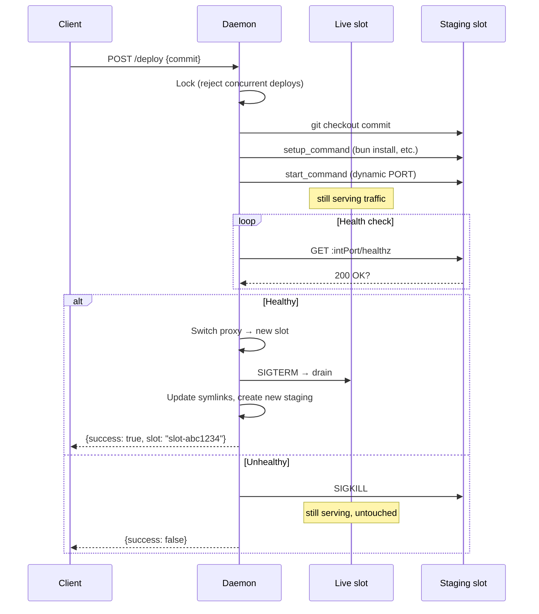

# slot-machine

Zero-downtime deploys on a single machine. One binary, three slots, symlink state.

```
slot-machine init       # detect project, generate config
slot-machine start      # start daemon, manage deploys
slot-machine deploy     # deploy HEAD (or a specific commit)
slot-machine rollback   # swap back to previous slot
slot-machine status     # what's running
```

## How it works

The daemon manages three **slots** — git worktrees of your app, each with a
role:

- **live** — serving traffic through the reverse proxy
- **prev** — the previous deploy, ready for instant rollback
- **staging** — a workspace for preparing the next deploy

```
  ┌──────────────────────────────────────────────────────────────┐
  │                    slot-machine daemon                       │
  │                                                              │
  │   ┌───────────────┐  ┌───────────────┐  ┌───────────────┐    │
  │   │  slot-a3f2... │  │  slot-7c36... │  │  slot-staging │    │
  │   │  (prev)       │  │  (live)       │  │  (workspace)  │    │
  │   │               │  │               │  │               │    │
  │   │  rollback     │  │  :51234 app   │  │  edit, test,  │    │
  │   │  target       │  │  :51235 int   │  │  commit here  │    │
  │   └───────────────┘  └───────┬───────┘  └───────────────┘    │
  │                              │                               │
  │                     reverse proxy                            │
  │                     :3000 ──►┘                               │
  └──────────────────────────────────────────────────────────────┘
```

Slots are named by commit hash (`slot-a3f2b1c4`). Each slot gets dynamic
ports — the daemon reverse-proxies the configured port to whichever slot is
live. State is persisted as symlinks (`live` → `slot-7c36...`, `prev` →
`slot-a3f2...`), so the daemon recovers after restart.

When a deploy promotes staging to live, the old live becomes prev, and the old
prev is garbage collected. A new staging is created as a CoW clone (APFS
`cp -c`) of the promoted slot — so `node_modules` and build artifacts carry
over instantly.

## Deploy sequence (zero-downtime)

The key difference from naive blue-green: **start before drain**. The new
process boots and passes health checks while the old process is still serving.
Traffic switches atomically via the reverse proxy.



## The agent workflow

The staging slot is designed as a workspace for an AI agent (or a human).
The typical cycle:

```
  ┌─────────┐     ┌───────────────┐     ┌────────────┐     ┌──────────┐
  │  pull   │────▶│  edit & test  │────▶│   commit   │────▶│  deploy  │
  │  main   │     │  in staging   │     │ to machine │     │          │
  └─────────┘     └───────────────┘     └────────────┘     └──────────┘
       ▲                                                        │
       └────────────────────────────────────────────────────────┘
                          staging slot rotates
```

1. The agent works on a `machine` branch in the staging slot
2. Humans push to `main` on the remote
3. The agent pulls `main` and merges it into `machine`
4. `slot-machine deploy` promotes the result
5. The old live slot becomes prev, staging is recreated — repeat

The live app is never touched. If a deploy fails health checks, the process
is killed and the live slot stays untouched. Rollback is always one command away.

## Quick start

```sh
cd your-app
slot-machine init          # generates slot-machine.json
slot-machine start         # starts daemon on :9100, proxies :3000
slot-machine deploy        # deploy current HEAD
slot-machine deploy abc123 # deploy a specific commit
slot-machine rollback      # swap back
slot-machine status        # check what's live
```

## Configuration

`slot-machine init` detects your project type and generates `slot-machine.json`:

```json
{
  "start_command": "bun server/index.ts",
  "setup_command": "bun install --frozen-lockfile",
  "port": 3000,
  "internal_port": 3000,
  "health_endpoint": "/healthz",
  "health_timeout_ms": 10000,
  "drain_timeout_ms": 5000,
  "env_file": ".env",
  "api_port": 9100
}
```

| Field | What it does |
|-------|-------------|
| `start_command` | How to start your app |
| `setup_command` | Runs after checkout, before start (e.g. install deps) |
| `port` | Public port — daemon reverse-proxies this to the live slot |
| `internal_port` | Health check port — proxied separately if different from `port` |
| `health_endpoint` | Path to poll for 200 OK |
| `health_timeout_ms` | How long to wait for healthy before giving up |
| `drain_timeout_ms` | Graceful shutdown window before SIGKILL |
| `env_file` | Loaded into the app's environment |
| `api_port` | Daemon API port for deploy/rollback/status |

Project detection: `bun.lock` → Bun, `package-lock.json` → npm,
`uv.lock` → uv, `Gemfile.lock` → Bundler.

### Environment variables

slot-machine injects these into managed processes:

| Variable | Value |
|----------|-------|
| `PORT` | Dynamic port for the app to listen on |
| `INTERNAL_PORT` | Dynamic port for health checks (may differ from `PORT`) |
| `SLOT_MACHINE` | Always `1` — apps can use this to detect they're running under slot-machine |

When `SLOT_MACHINE=1` is set, apps should listen on `INTERNAL_PORT` in addition
to `PORT` if they differ. This is the slot-machine contract for health checks.

## Tests

```sh
go test ./...   # builds binaries automatically, runs everything
```

The `spec/` directory defines the slot-machine contract as a black-box test
suite — all interaction is through the HTTP API. Covers deploy, rollback,
health checks, crash detection, drain timeout, concurrent deploy rejection,
zero-downtime, symlink state, GC, daemon restart recovery, and CLI UX.

Unit tests in `cmd/slot-machine/main_test.go` cover internal functions.

`stress-test.sh` runs an end-to-end scenario against a real Bun app:
deploy, rollback, intentional crash, branch merging, rapid-fire deploys,
and sustained load during deploy.

## API

| Method | Path | Description |
|--------|------|-------------|
| `GET` | `/` | Health check (`{"status":"ok"}`) |
| `POST` | `/deploy` | `{"commit":"abc..."}` → deploy |
| `POST` | `/rollback` | Swap to previous slot |
| `GET` | `/status` | Current state (live/prev/staging/healthy) |
